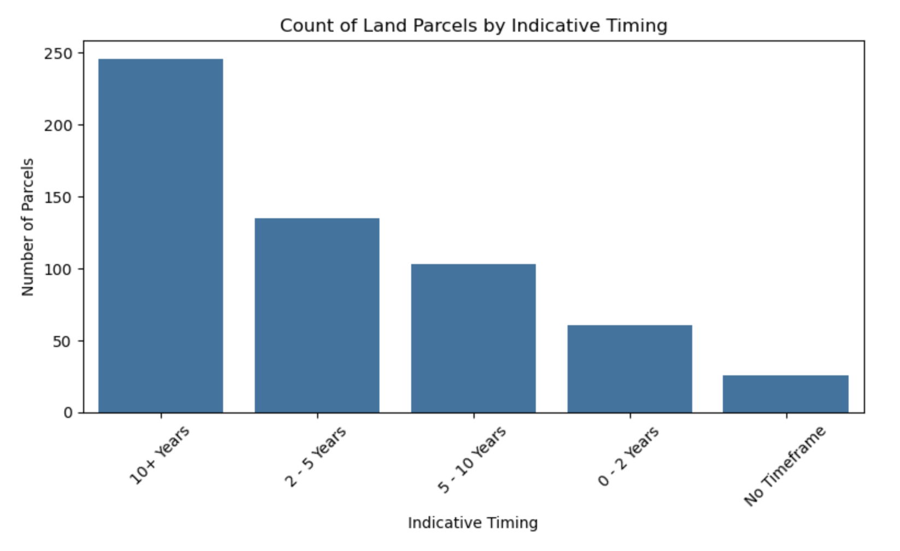
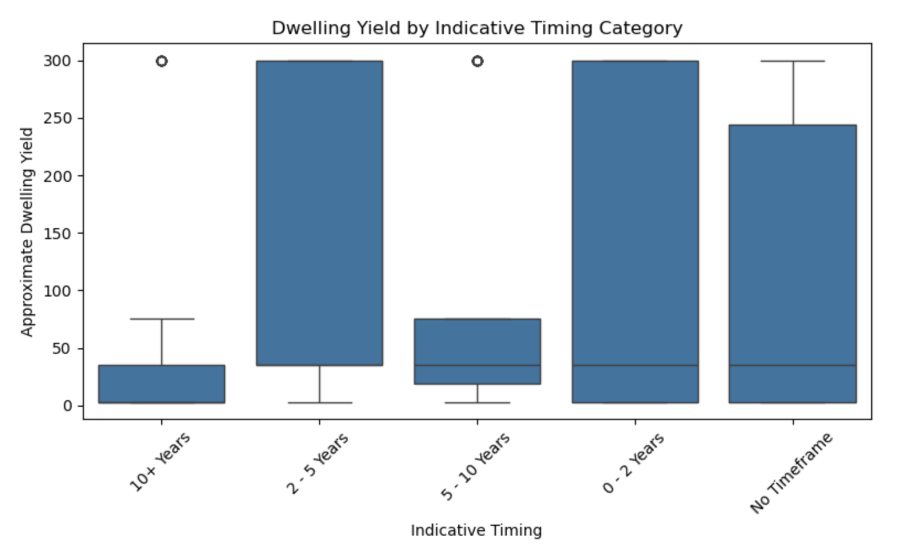

# Brisbane Housing Affordability Analysis

## Project Overview

This project analyses residential land supply and population growth in Brisbane to better understand housing availability and future housing demand. The analysis combines geospatial data, demographic projections, and machine learning techniques to explore how housing supply aligns with projected population growth across Brisbane SA2 regions.

The project integrates spatial datasets from the Queensland Spatial Catalogue with population projection data and applies data analysis, feature engineering, and predictive modelling to identify patterns in housing supply distribution.

  

---

## Objectives

- Analyse residential land supply across Brisbane
- Understand how land availability varies across SA2 regions
- Compare housing supply with projected population growth
- Estimate potential dwelling shortages or surpluses
- Apply machine learning models to predict dwelling yield patterns
- Categorise housing supply levels across regions

---

## Dataset Sources

### Spatial Land Supply Data

- Source: Queensland Spatial Catalogue
- File: QSC Extracted Data
- Contains residential land parcels and indicative development timing

### SA2 Boundary Data

- Source: Australian Bureau of Statistics
- File: SA2 2021 ASGS Shapefile
- Provides geographic boundaries for statistical areas

### Population Projection Data

- Source: Queensland population projections
- Contains projected population values for SA2 regions from 2021 to 2046

---

## Repository Structure

### Brisbane Housing Affordability.ipynb

- Main notebook containing data processing, spatial analysis, modelling, and visualisations

### data

Folder containing all datasets used in the analysis

- QSC Extracted Data
- SA2 2021 ASGS shapefile components
- Cleaned land supply datasets
- Population projection dataset
- Intermediate processed datasets

### README.md

- Project documentation

### .gitignore

- Excludes unnecessary system and temporary files

---

## Data Processing Workflow

### 1 Data Loading

- Load Queensland residential land supply data
- Load SA2 boundary shapefile
- Load population projection dataset

### 2 Data Cleaning

- Filter dataset for Brisbane Local Government Area
- Convert dwelling yield ranges into approximate numeric values
- Encode development timing categories
- Remove missing values

### 3 Spatial Processing

- Reproject spatial datasets to a common coordinate reference system
- Perform spatial join between land parcels and SA2 regions
- Assign each parcel to its SA2 region

### 4 Aggregation

Calculate summary statistics for each SA2 region

- Parcel count
- Total dwelling yield
- Average dwelling yield
- Average development timing

### 5 Feature Engineering

New variables are created to analyse housing pressure:

- Dwelling yield per capita
- Estimated dwelling need based on population growth
- Dwelling supply gap relative to projected demand
- Population growth between 2021 and 2046

### 6 Model Training

Machine learning models are trained to analyse housing supply patterns and predict dwelling yield.

- Train a Linear Regression model to estimate dwelling yield relationships
- Train a Random Forest Regression model to predict dwelling yield based on spatial and demographic features
- Train a Random Forest Classification model to categorise SA2 regions into housing supply levels

### 7 Model Evaluation

Model performance is evaluated using appropriate regression and classification metrics.

- Mean Absolute Error (MAE)
- Mean Squared Error (MSE)
- R² Score
- Classification report for housing supply categories
- Confusion matrix to analyse classification performance

---

## Exploratory Data Analysis

The project visualises several aspects of land supply and development patterns:

- Distribution of land parcels by development timing

  

  
- Dwelling yield across development timeframes

  

- Spatial distribution of residential land supply
- Correlation analysis between housing supply and population growth

---

## Machine Learning Models

### Linear Regression

Used to predict approximate dwelling yield using encoded land characteristics.

Model evaluation metrics include:

- Mean Absolute Error
- R² Score

### Random Forest Regression

Predicts total dwelling yield at the SA2 level using:

- Parcel count
- Average dwelling yield
- Population projections

Evaluation metrics include:

- Mean Absolute Error
- Mean Squared Error
- R² Score

  

### Random Forest Classification

SA2 regions are categorised into housing supply levels:

- Low supply
- Medium supply
- High supply

  

The classifier predicts the category based on:

- Parcel count
- Average dwelling yield
- Population projections

Performance is evaluated using a classification report.

---

## Key Insights

- Residential land supply varies significantly across Brisbane SA2 regions
- Some areas show strong population growth relative to available dwelling supply
- Machine learning models highlight regions where housing demand may outpace supply
- Spatial analysis helps visualise development timing and land availability patterns

---

## Technologies Used

### Programming

- Python

### Data Processing

- pandas
- numpy

### Geospatial Analysis

- geopandas
- contextily

### Visualisation

- matplotlib
- seaborn

### Machine Learning

- scikit learn

---

## Potential Future Improvements

- Integrate additional housing market datasets
- Include property price data
- Improve dwelling demand estimation models
- Build an interactive dashboard for spatial visualisation
- Apply advanced machine learning or spatial modelling techniques

---

## Author

### Samad Zaheer

Master of Information Technology (Data Science)  
Queensland University of Technology (QUT)