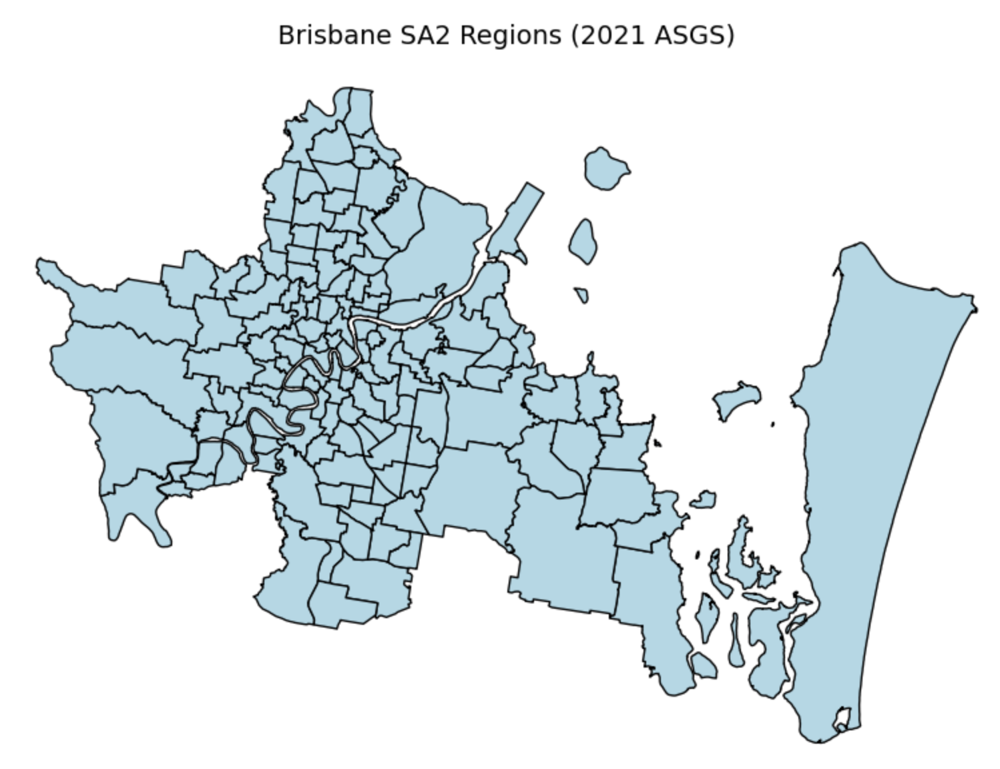
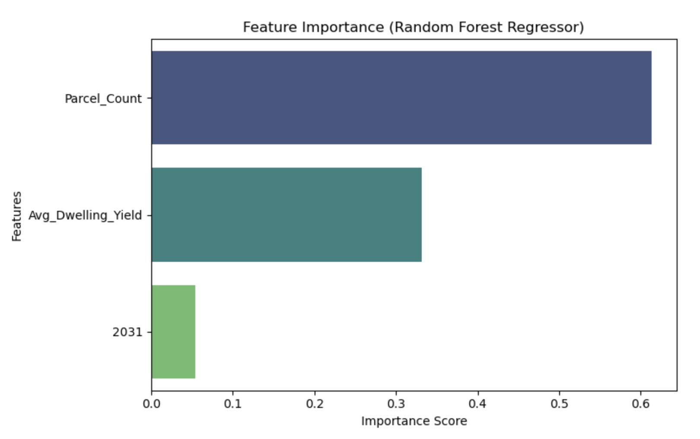
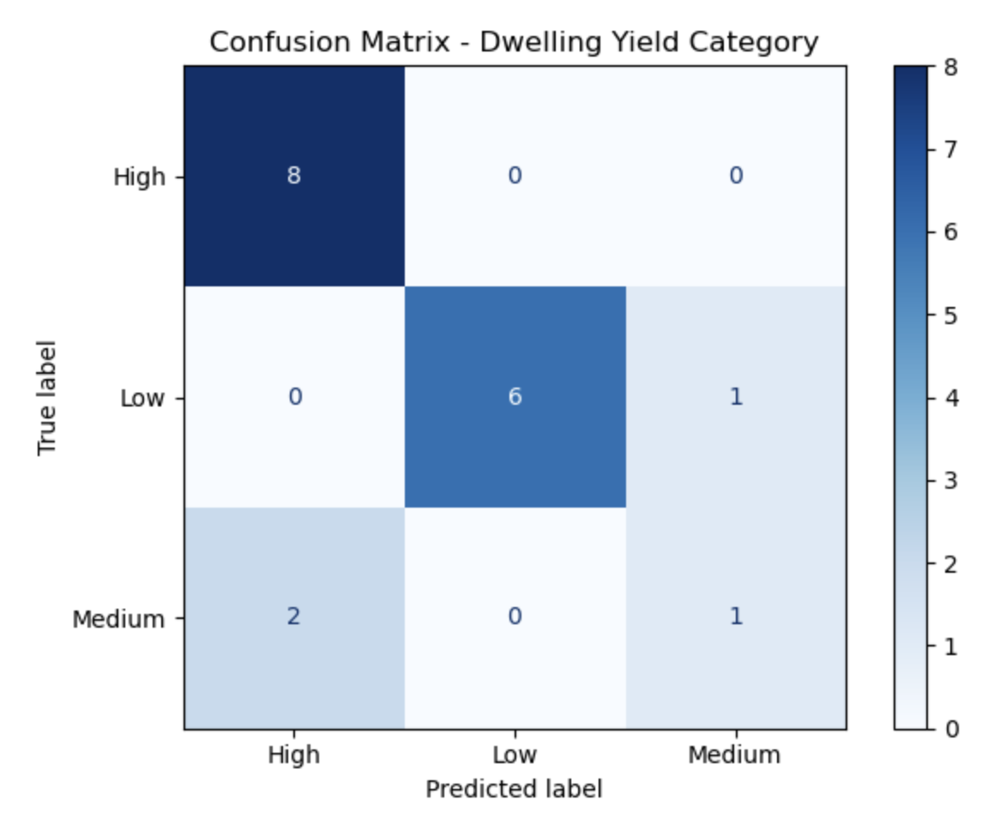

# Brisbane Housing Affordability Analysis

Geospatial machine learning analysis mapping housing supply shortfall across 33 Brisbane suburbs using ABS population projections and Queensland government land data.

---

## Project Overview

Brisbane's rapid population growth is putting pressure on housing supply — but that pressure is not evenly distributed. This project identifies which suburbs face the greatest risk of dwelling shortfall by combining government geospatial data with demographic projections and a machine learning classifier.

The output is suburb-level supply risk scores (low / medium / high) designed to support local government planners and property developers in making data-driven supply decisions. The classifier replaces expensive manual survey analysis with an automated, regularly-updatable model that can be re-run as new ABS or CoreLogic data becomes available.

---

## Dataset

| Source | Description |
|--------|-------------|
| Queensland Spatial Catalogue | Residential land supply boundaries and development timing for Brisbane parcels |
| ABS SA2 Boundary Shapefile (2021) | Geographic boundaries for 33 Statistical Area 2 regions |
| Queensland Population Projections | Projected population values per SA2 from 2021 to 2046 |

Key features: SA2 region boundaries, dwelling yields, residential land area, indicative development timing, population growth rates, projected shortfall/surplus ratios.

<p align="center">
  
</p>

---

## Approach

1. **Data loading & cleaning** — loaded Queensland residential land supply data, SA2 boundary shapefiles, and population projection datasets; filtered for Brisbane LGA; converted dwelling yield ranges into numeric values; encoded development timing categories
2. **Spatial processing** — reprojected all datasets to a common CRS; performed spatial join between land parcels and SA2 regions to assign each parcel to its statistical area
3. **Aggregation** — calculated per-SA2 summaries: parcel count, total dwelling yield, average dwelling yield, average development timing
4. **Feature engineering** — created dwelling yield per capita, estimated dwelling need from population growth, and supply gap relative to projected demand (2021–2046)
5. **Model training** — trained and compared three approaches:
   - **Linear Regression** — baseline continuous yield estimation
   - **Random Forest Regressor** — non-linear yield estimation
   - **Random Forest Classifier** — final model; labels each SA2 as low / medium / high supply risk
6. **Evaluation** — MAE, MSE, R² for regression models; classification report and confusion matrix for the classifier

<p align="center">
  
</p>

<p align="center">
  
</p>

---

## Key Findings

- **83% classification accuracy** for suburb-level supply risk across 33 SA2 regions
- Residential land supply varies significantly across Brisbane — housing pressure is not uniform across the metro area
- Inner-city and high-growth corridor suburbs show the highest supply pressure relative to available land
- Dwelling yield and supply ratio are the strongest predictors of shortfall risk; Random Forest consistently outperformed Linear Regression on these non-linear spatial patterns
- The model produces a repeatable, data-driven input for planning decisions — it can be re-run as new ABS or CoreLogic data becomes available without rebuilding from scratch

---

## How to Run

```bash
git clone https://github.com/SamadZaheer/Brisbane-Housing-Affordability.git
cd Brisbane-Housing-Affordability
pip install -r requirements.txt
jupyter notebook "Brisbane Housing Affordability.ipynb"
```

> **Data:** The spatial datasets are sourced from the Queensland Spatial Catalogue and ABS. Download links and file paths are referenced inside the notebook. Place downloaded files in the `data/` folder before running.

---

## Author

**Samad Zaheer** — Master of Information Technology (Data Science), Queensland University of Technology (QUT)
